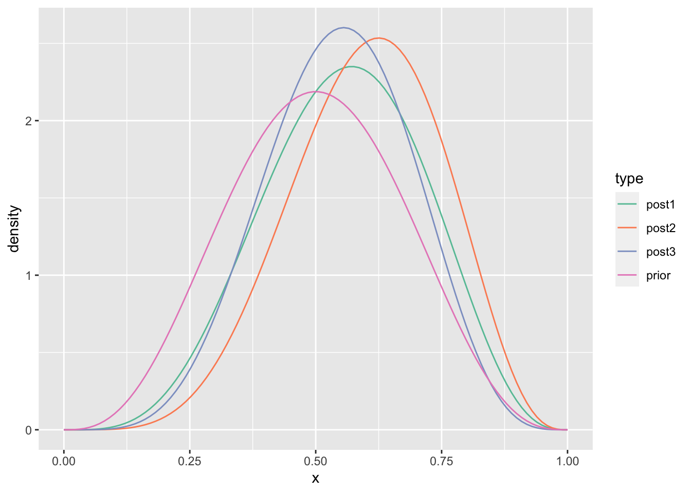
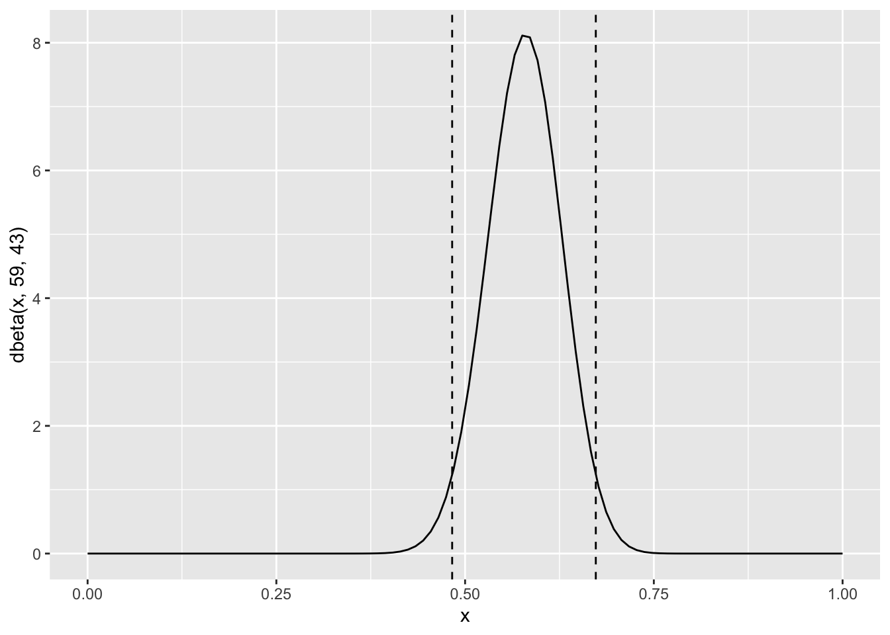
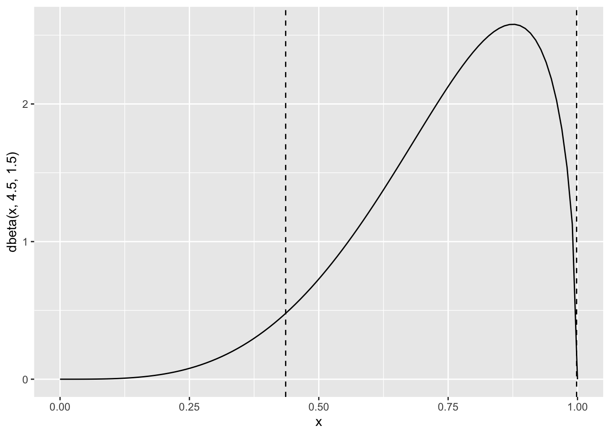
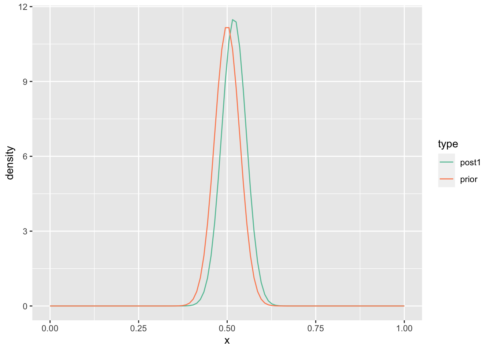
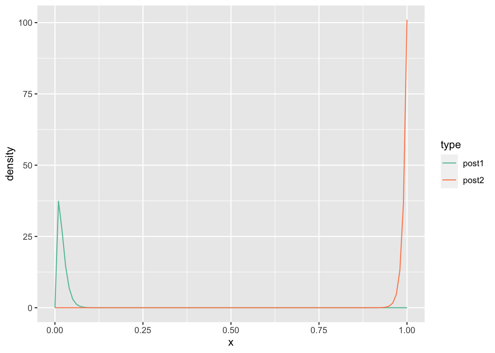
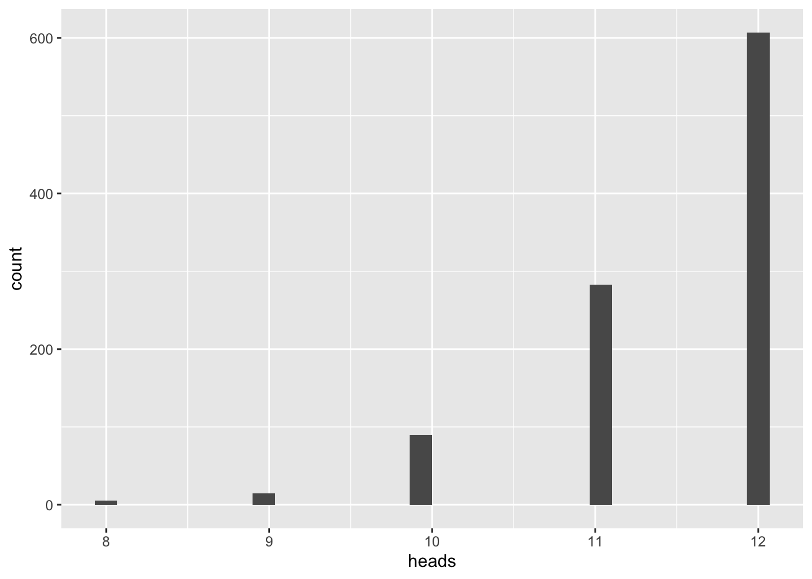

# Binomial Proportions via Mathematical Analysis


```r
library(tidyr)
library(magrittr)
library(ggplot2)
library(RColorBrewer)
```

## Excercise 5.1


```r
# HHT Sequence
N <- 100
x <- seq(0, 1, length.out = N)
prior <- dbeta(x, 4, 4)
post1 <- dbeta(x, 5, 4)
post2 <- dbeta(x, 6, 4)
post3 <- dbeta(x, 6, 5)

tibble::tibble(x = x, prior = prior, post1 = post1,
               post2 = post2, post3 = post3) %>%
  pivot_longer(cols=-x, values_to="density", names_to="type") %>%
  ggplot() +
  geom_line(mapping=aes(x=x, y=density, color=type)) +
  scale_color_brewer(palette="Set2")
```



```r
# THH Sequence
N <- 100
x <- seq(0, 1, length.out = N)
prior <- dbeta(x, 4, 4)
post1 <- dbeta(x, 4, 5)
post2 <- dbeta(x, 5, 5)
post3 <- dbeta(x, 6, 5)

tibble::tibble(x = x, prior = prior, post1 = post1,
               post2 = post2, post3 = post3) %>%
  pivot_longer(cols=-x, values_to="density", names_to="type") %>%
  ggplot() +
  geom_line(mapping=aes(x=x, y=density, color=type)) +
  scale_color_brewer(palette="Set2")
```


## Exercise 5.2

### Part a

```r
HDIofICDF = function( ICDFname , credMass=0.95 , tol=1e-8 , ... ) {
   # Arguments:
   #   ICDFname is R's name for the inverse cumulative density function
   #     of the distribution.
   #   credMass is the desired mass of the HDI region.
   #   tol is passed to R's optimize function.
   # Return value:
   #   Highest density iterval (HDI) limits in a vector.
   # Example of use: For determining HDI of a beta(30,12) distribution, type
   #   HDIofICDF( qbeta , shape1 = 30 , shape2 = 12 )
   #   Notice that the parameters of the ICDFname must be explicitly named;
   #   e.g., HDIofICDF( qbeta , 30 , 12 ) does not work.
   # Adapted and corrected from Greg Snow's TeachingDemos package.
   incredMass =  1.0 - credMass
   intervalWidth = function( lowTailPr , ICDFname , credMass , ... ) {
      ICDFname( credMass + lowTailPr , ... ) - ICDFname( lowTailPr , ... )
   }
   optInfo = optimize( intervalWidth , c( 0 , incredMass ) , ICDFname=ICDFname ,
                        credMass=credMass , tol=tol , ... )
   HDIlowTailPr = optInfo$minimum
   return( c( ICDFname( HDIlowTailPr , ... ) ,
	            ICDFname( credMass + HDIlowTailPr , ... ) ) )
}
```


```r
(lim <- HDIofICDF(qbeta, shape1=59, shape2=43))
```

```
## [1] 0.4828696 0.6731385
```

```r
x <- seq(0, 1, length.out = 100)
ggplot() +
  geom_line(mapping=aes(x = x,
                        y = dbeta(x, 59, 43))) +
  geom_vline(mapping=aes(xintercept=lim), linetype="dashed")
```


### Part b

Yes, it is credible to believe the population is evenly split between the two candidates (0.5 is within the 95% credible interval).

### Part c


```r
HDIofICDF(qbeta, shape1=57+59, shape2=43+43)
```

```
## [1] 0.5061148 0.6419895
```
### Part d

No, it is not credible to believe the population is evenly split between the two candidates (0.5 is outside the 95% credible interval).

## Excercse 5.3


```r
HDIofICDF(qbeta, shape1=41, shape2=11)
```

```
## [1] 0.6771853 0.8934740
```

```r
HDIofICDF(qbeta, shape1=16, shape2=36)
```

```
## [1] 0.1865395 0.4329478
```
In the first case, subjects are biased towards "F", and in the second case subjects are biased towards "J".

## Exercise 5.4


```r
(lim <- HDIofICDF(qbeta, shape1=4.5, shape2=1.5))
```

```
## [1] 0.4360173 0.9982900
```

```r
x <- seq(0, 1, length.out = 100)
ggplot() +
  geom_line(mapping=aes(x = x,
                        y = dbeta(x, 4.5, 1.5))) +
  geom_vline(mapping=aes(xintercept=lim), linetype="dashed")
```



## Exercise 5.5

### Part a

```r
# HHT Sequence
N <- 100
x <- seq(0, 1, length.out = N)
prior <- dbeta(x, 100, 100)
post1 <- dbeta(x, 109, 101)

tibble::tibble(x = x, prior = prior, post1 = post1) %>%
  pivot_longer(cols=-x, values_to="density", names_to="type") %>%
  ggplot() +
  geom_line(mapping=aes(x=x, y=density, color=type)) +
  scale_color_brewer(palette="Set2")
```



The predicted probability for the next coin flip is the expected value of Beta(109, 101) which is $\frac{109}{109+101} = 0.519$

### Part b


```r
# HHT Sequence
N <- 100
x <- seq(0, 1, length.out = N)
prior <- dbeta(x, 0.5, 0.5)
post1 <- dbeta(x, 9.5, 1.5)

tibble::tibble(x = x, prior = prior, post1 = post1) %>%
  pivot_longer(cols=-x, values_to="density", names_to="type") %>%
  ggplot() +
  geom_line(mapping=aes(x=x, y=density, color=type)) +
  scale_color_brewer(palette="Set2")
```


The predicted probability for the next coin flip is the expected value of Beta(9.5, 1.5) which is $\frac{9.5}{9.5+1.5} = 0.864$

## Exercise 5.6


```r
N <- 100
x <- seq(0, 1, length.out = N)

# Model 1 - Fair coin
post1 <- dbeta(x, 105, 115)
prob1 <- beta(115, 105)/beta(100, 100)
# Model 2 - Biased coin
post2 <- dbeta(x, 15.5, 5.5)
prob2 <- beta(15.5, 5.5)/beta(0.5, 0.5)

tibble::tibble(x = x, post1 = post1, post2 = post2) %>%
  pivot_longer(cols=-x, values_to="density", names_to="type") %>%
  ggplot() +
  geom_line(mapping=aes(x=x, y=density, color=type)) +
  scale_color_brewer(palette="Set2")
```


Fair coin model probability = 1.1424631\times 10^{-6}.

Biased coin model probability = 2.2930726\times 10^{-6}.

The Bayes Factor = 0.4982237.

There is slightly more evidence in favor of the biased coin model.

## Exercise 5.7


```r
N <- 100
x <- seq(0, 1, length.out = N)

# Model 1 - Tail-biased coin
post1 <- dbeta(x, 2, 100)
prob1 <- beta(2, 100)/beta(1, 100)
# Model 2 - Head-biased coin
post2 <- dbeta(x, 101, 1)
prob2 <- beta(101, 1)/beta(100, 1)

tibble::tibble(x = x, post1 = post1, post2 = post2) %>%
  pivot_longer(cols=-x, values_to="density", names_to="type") %>%
  ggplot() +
  geom_line(mapping=aes(x=x, y=density, color=type)) +
  scale_color_brewer(palette="Set2")
```



Tail-biased coin model probability = 0.009901.

Head-biased model probability = 0.990099.

The Bayes Factor = 0.01.

There is significantly more evidence in favor of the head-biased coin model.

## Exercise 5.8

### Part a


```r
N <- 100
x <- seq(0, 1, length.out = N)

# Model 1 - Tail-biased coin
post1 <- dbeta(x, 9, 104)
prob1 <- beta(9, 104)/beta(1, 100)
# Model 2 - Head-biased coin
post2 <- dbeta(x, 108, 5)
prob2 <- beta(108, 5)/beta(100, 1)

tibble::tibble(x = x, post1 = post1, post2 = post2) %>%
  pivot_longer(cols=-x, values_to="density", names_to="type") %>%
  ggplot() +
  geom_line(mapping=aes(x=x, y=density, color=type)) +
  scale_color_brewer(palette="Set2")
```


Tail-biased coin model probability = 2.0222009\times 10^{-12}.

Head-biased model probability = 1.4908272\times 10^{-7}.

The Bayes Factor = 1.3564288\times 10^{-5}.

There is significantly more evidence in favor of the head-biased coin model.

### Part b


```r
iterations <- 1000
heads <- rep(NA, iterations)

for (i in seq_along(heads)) {
  theta <- rbeta(1, 108, 5)
  heads[i] <- rbinom(1, 12, theta)
}

ggplot()+
  geom_histogram(mapping=aes(x=heads))
```

```
## `stat_bin()` using `bins = 30`. Pick better value with `binwidth`.
```



1000 samples of size 12 were simulated.

### Part c

Different values of $\theta$ were used for each simulated sample because each time we sample from the posterior distribution of $\theta$.

### Part d

The heads-biased model, while better than the tails-biased model, is still not a good fit to the observed data (8 heads in 12 tosses); it predicts a much higher number of heads than observed.


